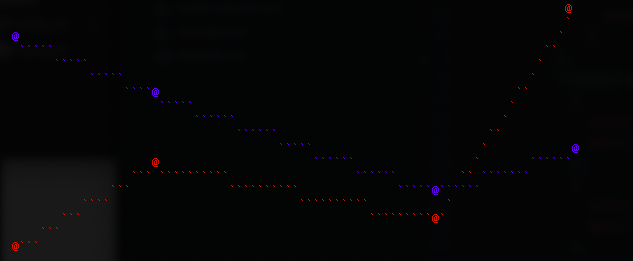

Ascii Art Graph
===============


Currently uses d3 internally for range generation, but the eventual goal is a "drop in" d3 compatible interface

Usage
-----

```javascript
var graph = new Graph.Timeseries({
    height : 20,
    width : 80,
    node : '@',
    line : '`',
    timeField : 'date',
    valueField : 'value',
    colors : ['red', 'blue']
});
graph.render({
    'timeseries-a' : [
      {
        value: 2,
        date: '2019-11-25T01:55:45.000Z',
      },
      {
        value: 5,
        date: '2019-11-25T01:56:45.000Z',
      },
      {
        value: 3,
        date: '2019-11-25T01:58:45.000Z',
      },
      {
        value: 11,
        date: '2019-11-25T01:59:45.000Z',
      }
  ],
  'timeseries-b' : [
    {
      value: 10,
      date: '2019-11-25T01:55:45.000Z',
    },
    {
      value: 8,
      date: '2019-11-25T01:56:45.000Z',
    },
    {
      value: 4,
      date: '2019-11-25T01:58:45.000Z',
    },
    {
      value: 6,
      date: '2019-11-25T01:59:45.000Z',
    }
  ]
}, function(err, result){
    should.not.exist(err);
    should.exist(result);
    result.should.equal(multi.toString());
    done();
});
```

will render:


Roadmap
-------
- node output
- braille UTF support
- axes & labels
